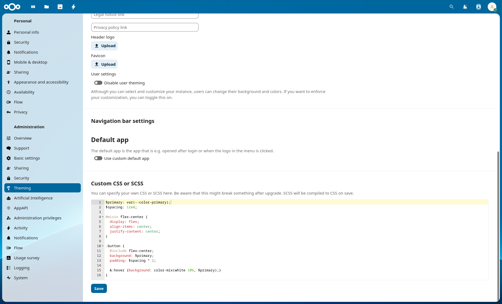
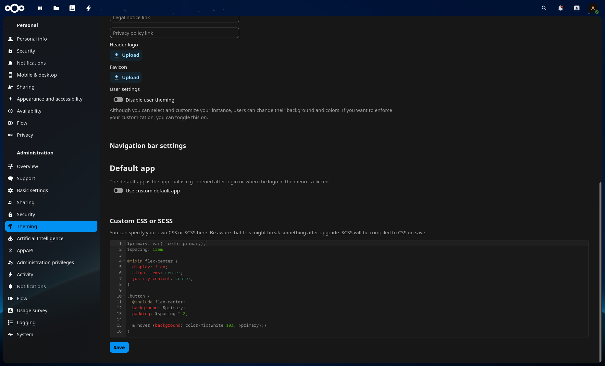

# Custom (S)CSS: customize your CSS to better fit your Theming needs

Allow admins to add custom CSS or SCSS to their Nextcloud instance from inside the Theming settings.

<div style="display: flex;">
<div style="height:200px; margin-bottom: 200px;">



</div>
<div style="height:200px; margin-bottom: 200px;">


    
</div>
</div>

## CSS and SCSS support

The admin settings field accepts both plain CSS and SCSS. SCSS is compiled to CSS
in your browser (via sass.js) when you save; the compiled CSS is what's actually
loaded on every page, while your raw SCSS source is kept so the editor can be
prefilled with it next time you open the settings.

The input is a syntax-highlighted code editor (Ace), with light/dark themes that
follow your nextcloud's and system's color scheme.

## Use theming color values

Admins can use CSS custom properties to make use of the variables that are available from the [default.css variables file](https://github.com/nextcloud/server/blob/master/apps/theming/css/default.css):

Example:

```css
#element {
  color: var(--color-primary);
}
```

## *How can I recover if my customized CSS or SCSS code has broken the user interface?*

The CSS/SCSS configuration is stored in the app config database table, and you can use the `occ config:app:*` commands to obtain, modify, or reset it:

```bash
occ config:app:get theming_customcss customcss
occ config:app:get theming_customcss customscss
occ config:app:delete theming_customcss customcss
occ config:app:delete theming_customcss customscss
```

## Usage via occ command

_Only applies to compiled CSS, not SCSS — the occ commands don't run the SCSS compiler._

```bash
occ config:app:set theming_customcss customcss --value "body { background-color: red; }"
```

Note: if your CSS contains single or double quotes, make sure they're properly escaped so the shell doesn't break the command:

```bash
occ config:app:set theming_customcss customcss --value '.app-navigation-personal li[data-section-id="workflow"] { display:none } '
```

---

## Third-party code

- `js/vendor/sass.js`, `js/vendor/sass.worker.js` — sass.js by Rodney Rehm, MIT License. See `js/vendor/VENDOR-sass.js.txt`.
- `js/vendor/ace/` — Ace editor by Ajax.org, BSD-3-Clause License. See `js/vendor/ace/LICENSE`.